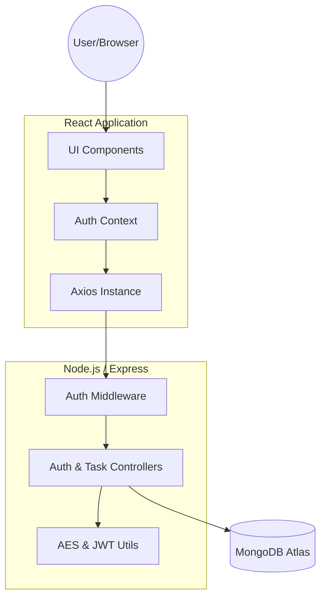

# TaskFlow – Task Management Application
*(Full Stack Technical Assessment)*

TaskFlow is a production-ready Task Management Application demonstrating a comprehensive backend architecture, robust authentication, top-tier security practices, and a modern frontend integration.

## 🚀 Live Links
- **GitHub Repository:** [https://github.com/AdityaSingh5025/Taskflow.git](https://github.com/AdityaSingh5025/Taskflow.git)
- **Live Deployed URL:** [Placeholder Link]

## 🏗 System Architecture

TaskFlow follows a clean MVC (Model-View-Controller) architecture on the backend, ensuring a strict separation of concerns.



### Key Architectural Decisions:
- **Backend:** Node.js with Express for high-performance API handling.
- **Frontend:** React (Vite) for a fast, modern user experience.
- **Security First:** Access tokens are passed via headers (Bearer), while Refresh tokens are stored in secure **HttpOnly cookies** to neutralize XSS and CSRF risks.
- **Data Privacy:** Sensitive task descriptions are encrypted at rest using **AES-256-GCM**.

---

## 🔐 Security & Advanced Features
- **JWT-based Auth:** Multi-token strategy (Access + Refresh) with silent refresh logic.
- **Passwords:** Securely hashed using **Bcrypt** with industry-standard salt rounds.
- **Encryption:** All task descriptions are encrypted via **AES-256-GCM** before database storage.
- **Validation:** Strict input validation and sanitization using case-insensitive regex escaping for search.
- **Zero-Dependency State:** Custom React Context implementation avoids the weight of external libraries like Redux.

---

## 🛠 Setup & Installation

### 1. Prerequisites
- Node.js (v18+)
- MongoDB Atlas account (for `MONGO_URI`)

### 2. Environment Configuration
Create a `.env` file in the `server` directory:
```env
MONGO_URI=your_mongodb_uri
JWT_SECRET=your_jwt_access_secret
REFRESH_TOKEN_SECRET=your_jwt_refresh_secret
ENCRYPTION_KEY=32_char_aes_key
SECRET=hmac_otp_secret
EMAIL_USER=your_smtp_email
EMAIL_PASS=your_smtp_app_password
PORT=5001
NODE_ENV=development
```

### 3. Execution
Run the following from the root directory:
```bash
npm run install-all  # Installs both client & server dependencies
npm run dev          # Starts both servers concurrently
```
Access the application at `http://localhost:5173`.

---

## 📖 API Documentation

### Authentication
#### Login
- `POST /api/auth/login`
- **Request:** `{ "email": "me@example.com", "password": "password123" }`
- **Response:** `200 OK`
```json
{
  "success": true,
  "accessToken": "ey...",
  "user": { "name": "User", "email": "me@example.com" }
}
```

### Task Management (Authorized)
#### Fetch Tasks
- `GET /api/tasks?page=1&limit=10&status=todo&search=report`
- **Response:** `200 OK`
```json
{
  "success": true,
  "tasks": [...],
  "pagination": { "total": 1, "page": 1, "totalPages": 1 }
}
```

---

## 🤖 AI Usage Policy
This application was developed with the assistance of **Antigravity by DeepMind**. AI tools were used for:
- Initial project scaffolding and boilerplate.
- Implementation of complex cryptographic functions (AES-256-GCM).
- Responsive UI design and glassmorphism styling.
- Comprehensive documentation and architectural planning.

All AI-assisted implementations have been reviewed, refined, and verified manually to ensure architectural integrity and security compliance.
